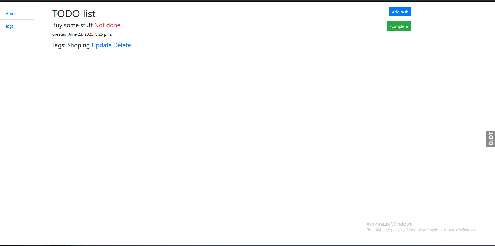
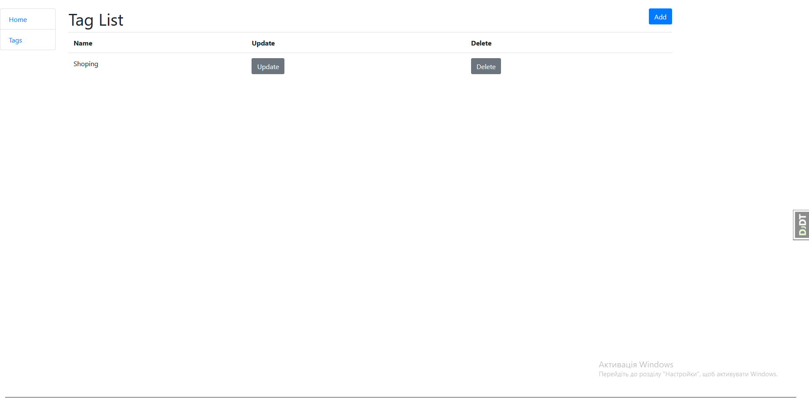

# Todo-list

## Home page:


## Tad list page:

## Installation:

## 1.Clone the repository:

  ```git clone https://github.com/MykytaKop/Todo-list.git```
## 2.Create a virtual environment and activate it:

 ```python -m venv .venv``` ```.venv\Scripts\activate (on Windows)``` ```source .venv/bin/activate (on macOS) ```
## 3.Install the project dependencies:

 ```pip install -r requirements.txt```
## 4.Create a database and migrate the models:

 ```python manage.py makemigrations```
 ```python manage.py migrate```

## 5.Start the server:

  ```python manage.py runserver```